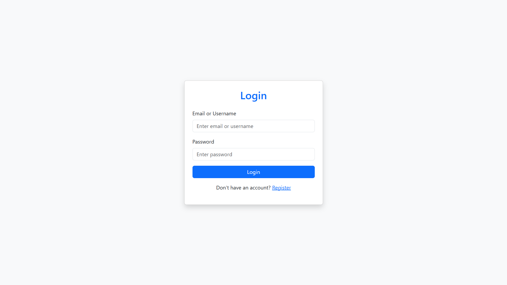
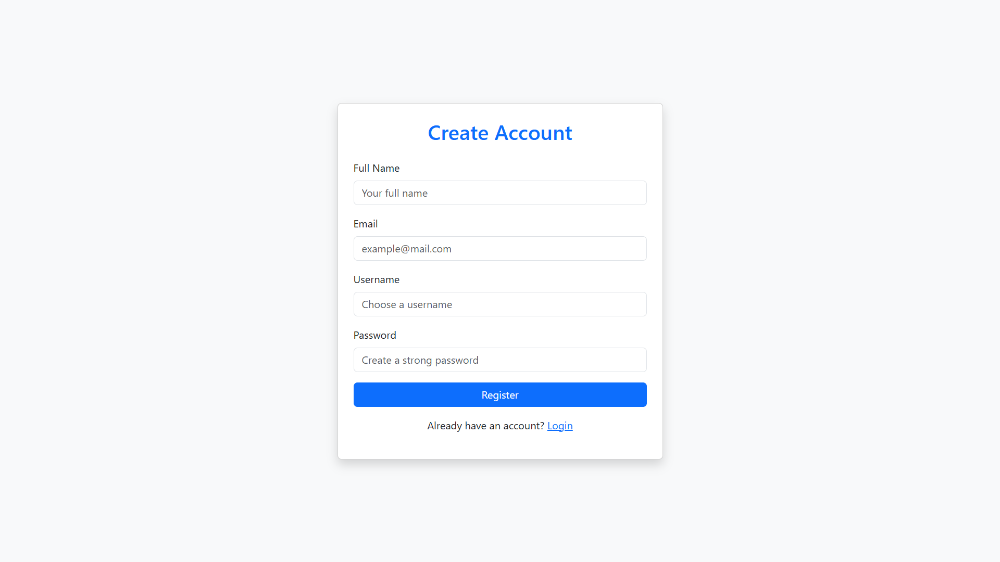
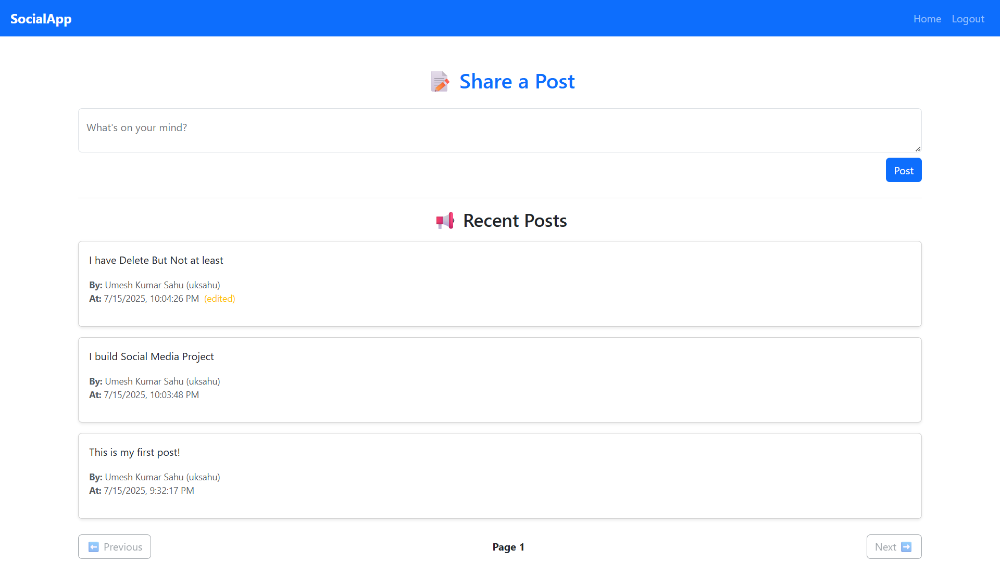
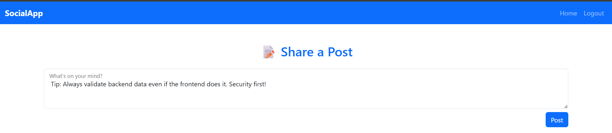

# 🧑‍🤝 MERN Social Media App

A full-stack social media web application built with the **MERN stack (MongoDB, Express.js, React.js, Node.js)**. Users can register, log in, create, edit, and delete posts.

---

## 🚀 Features

- 🔐 User Authentication (JWT-based)
- 📝 Create, edit, delete posts
- 👥 View all users' posts
- 📱 Fully responsive UI with Bootstrap
- ✅ Toast notifications and error handling
- 🔁 Pagination for post feed

---

## 🛠️ Technology Stack

### Frontend:
- React.js
- React Router
- Axios
- Bootstrap 5
- React Toastify

### Backend:
- Node.js
- Express.js
- MongoDB (Atlas)
- Mongoose
- JSON Web Token (JWT)
- Dotenv
- CORS

---

## 📦 Setup Instructions

### 🔧 Backend Setup

1. Navigate to the backend directory:

   cd backend

2. Install backend dependencies:

    npm install

3. Create a .env file in the backend folder and add the following:  

    MONGODB_URI=your_mongodb_connection_string
    JWT_SECRET=your_jwt_secret_key
    PORT=5000

4. Start the backend server:

    npm start

### 🎨 Frontend Setup

1. Navigate to the frontend directory:

    cd frontend

2. Install frontend dependencies:

    npm install

3. Start the frontend app:

    npm start

4. Open your browser and go to:

    http://localhost:3000
  

### 🧪 API Endpoints

# 🔐 Auth Routes
| Method | Endpoint             | Description         |
| ------ | -------------------- | ------------------- |
| POST   | `/api/auth/register` | Register a new user |
| POST   | `/api/auth/login`    | Login user          |

# 📝 Post Routes (Protected)
| Method | Endpoint         | Description         |
| ------ | ---------------- | ------------------- |
| GET    | `/api/posts`     | Get paginated posts |
| POST   | `/api/posts`     | Create new post     |
| PUT    | `/api/posts/:id` | Update post by ID   |
| DELETE | `/api/posts/:id` | Delete post by ID   |

### 📸 Screenshots

# 🔐 Login Page

# Register Page

# 📝 Home / Post Feed

### 🌐 Live Demo

🔗 https://social-frontend-topaz.vercel.app

# 📁 Project Structure

mern-social-media/
├── backend/
│   ├── controllers/
│   ├── models/
│   ├── routes/
│   ├── middleware/
│   ├── server.js
│   └── .env
├── frontend/
│   ├── src/
│   │   ├── components/
│   │   ├── pages/
│   │   ├── utils/
│   │   └── App.js
│   └── public/
├── .gitignore
├── README.md

### 👨‍💻 Author

Umesh Kumar Sahu
📧 sahuumesh540@gmail.com
https://www.linkedin.com/in/umeshkumarsahu-dev/